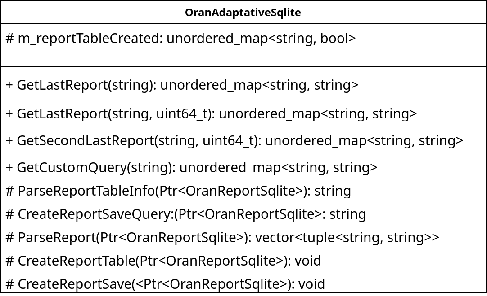
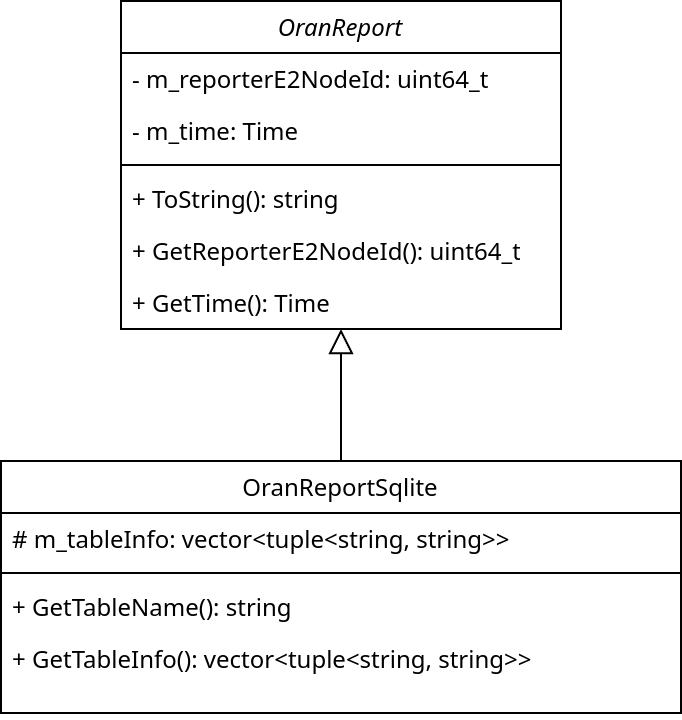

.. include:: replace.txt
.. highlight:: cpp

O-RAN Adaptative Sqlite Desciption
-------------------------------------

New funcionaties
****************
Modifications were made to the ns3-oran extension to implement support for managing arbitrary reports. These changes only add new functionality to the simulator without impacting existing features. As a result, the added tools are backward-compatible, ensuring that all code written using the standard extension remains fully functional.

The database system, ``OranAdaptativeSqlite``, dynamically manages incoming reports based on their type:

* For default reports (predefined in the simulator), data is added to the SQLite database as usual.

* For custom reports (inheriting from ``OranReportSqlite``): The database checks if a report of this type has been received before by verifying the table name provided by the report’s GetTableName method. If the table does not exist: A new table is created using the schema defined by the report’s GetTableInfo method. This table includes columns for the sender node’s ID and the report’s timestamp. If the table exists: The report’s data is added to the existing table.

The OranAdaptativeSqlite class provides four public methods for querying data:

* ``GetLastReport``:

  * One version takes a table name (``string``) and returns the most recent entry from that table.

  * A second version takes a table name (``string``) and a node ID (``uint64_t``), returning the last report of that type from the specified node.

* ``GetSecondLastReport``: Functions like ``GetLastReport`` but retrieves the second-most recent report, useful for analyzing changes between consecutive reports.

* ``GetCustomQuery``: Accepts any SQLite query (as a ``string``) and returns the results.

All methods return data in an ``unordered_map`` format, where keys represent report fields and values hold the corresponding data. If a method fails (e.g., invalid query, missing table, or node ID), it throws an exception.

The figure below show the new implemented methods of ``OranAdaptativeSqlite``. Further details of this class can be found in the Doxygen documentation

Creating new reports
********************

To create a custom report, the user must specialize the ``OranReportSqlite`` class. This class has three public virtual methods that must be overridden:

* ``GetTableInfo``: Returns a vector of string tuples.

* ``GetTableName``: Returns a string.

* ``ToString``: Returns a string.

The ``GetTableName`` method must return the name of the table to be used in the database. This name allows xApps to access data inserted into the table. The ``GetTableInfo`` method returns information about the field names and data types for each metric included in the report. These details are used to create new tables for custom reports. Finally, the ``ToString`` method should return a string containing the report name followed by the data to be inserted into the database, enclosed in parentheses and separated by semicolons.

The listing below demonstrates how to override the methods required to create a custom report containing the IPv4 address of a network node, as used in one of the examples::

  OranReportUeIpv4::OranReportUeIpv4() : OranReportSqlite()
  {
      m_tableInfo.emplace_back("ipv4", "TEXT");
  }
  
  std::string OranReportUeIpv4::ToString() const
  {
      std::stringstream ss;
      Time time = GetTime();
  
      ss << "OranReportIpv4(" << "nodeid=" << GetReporterE2NodeId() << ";time=" << time.GetTimeStep() << ";ipv4=" << "\"" << m_ipv4 << "\"" << ")";
  
      return ss.str();
  }
  
  std::vector<std::tuple<std::string, std::string>> OranReportUeIpv4::GetTableInfo()
  {
      return m_tableInfo;
  }
  
  std::string OranReportUeIpv4::GetTableName()
  {
      return "UeIpv4";
  }

The figure below shows a simplified UML diagram of the ``OranReportSqlite`` class. Further details can be found in the Doxygen documentation.

