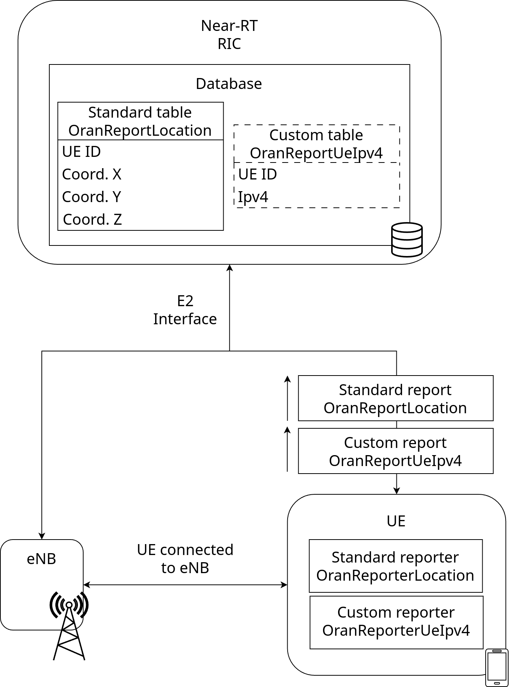
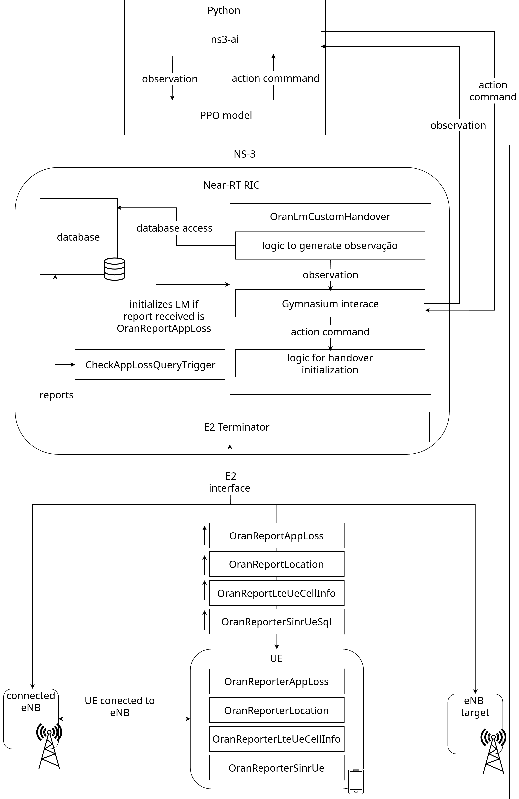

.. include:: replace.txt
.. highlight:: cpp

O-RAN Adaptative Sqlite Examples
-------------------------------------

Simple-db-example
**************************

This example aims to illustrate the use of the new data storage system in conjunction with pre-existing reports. It is a simple example simulating the Near-RT RIC, involving only one user device and one eNB. Both the user device and the eNB are nodes in the O-RAN network. The example consists of five files, namely ``oran-report-ue-ipv4.cc``, ``oran-report-ue-ipv4.h``, ``oran-reporter-ue-ipv4.cc``, ``oran-reporter-ue-ipv4.h`` and ``simple-db-usage.cc``.

The files ``oran-reporter-ue-ipv4.cc`` and ``oran-reporter-ue-ipv4.h`` implement the class containing the logic for a reporter. The purpose of the reporter is to generate a report. This class is added to a user device and is used whenever the device prepares a report to be sent to the Near-RT RIC. The function of this class is to create a report of type OranReportUeIpv4 and write data to it. The complete implementation code for these two files can also be found in Appendix A.

The file ``simple-db-usage.cc`` is the main file and consists of simulating an LTE network with one eNB and one user device. A Near-RT RIC is also created, and both the user device and the eNB are E2 nodes of this controller. A constant position is defined for the eNB, and a constant-speed mobility model is added to the UE. A location reporter (which generates reports already implemented by default in ns3-oran) and an IPv4 reporter (which generates custom reports, as described earlier) are also added to the UE. The simulation lasts 10 seconds, and periodically, every second, reports are sent from the UE to the Near-RT RIC. When running the simulation, all SQLite database queries are displayed on the screen.

The figure below illustrates the example. The figure shows an eNB, a UE, and the Near-RT RIC. The UE is connected to the eNB, and both the UE and the eNB are connected to the Near-RT RIC via the E2 interface. The UE has two reporters that generate periodic location and IPv4 address reports. The reports are sent from the UE to the Near-RT RIC via the E2 interface (indicated by the arrow next to the report). The Near-RT RIC contains a database with two tables. The OranReportLocation table, shown with a solid line, corresponds to the location reports implemented by default in ns3-oran. This table is initialized by default at the start of the simulation. The OranReportUeIpv4 table, shown with a dotted line, corresponds to the custom report. This table, as well as any custom report tables, is dynamically generated during the simulation when the first report of that type arrives at the Near-RT RIC.

RL-handover-example 
*********************

The second example provided with the tool aims to demonstrate how the implemented database model can be used to train a reinforcement learning model. This example implements a logic module that trains a reinforcement learning model using Proximal Policy Optimization (PPO) to manage handover decisions, with the goal of minimizing packet loss rates. For demonstration purposes, the example simulates handover management in a scenario with one UE and two eNBs.

This simulation example additionally uses the ns3-ai module, which enables communication between ns-3 simulation scripts and an external Python process. With ns3-ai, a Gymnasium environment can be defined in C++ within ns-3 simulation scripts. This environment is then accessible from a Python script, allowing the ns-3 simulation to act as a training scenario for reinforcement learning.

The eNBs have fixed positions in all simulation instances, while the UE starts at a random position with a random constant velocity along the X-axis. The UE’s velocity depends on its starting position to ensure it moves toward the farthest eNB, frequently triggering handover scenarios.

Both the UE and eNBs are connected to the Near-RT RIC. Periodically, the UE generates reports containing its spatial position, observed packet loss rate since the last report, and its signal-to-noise ratio (SINR) with the currently connected eNB. Whenever the Near-RT RIC receives a packet loss report from a UE, the main logic module (responsible for training the machine learning model for handover management) generates an observation for the model. This observation includes packet loss rate, SINR, and the UE’s distance to each eNB. The model processes this data and returns the index of the eNB the UE should connect to. If the indicated eNB matches the UE’s current connection, no action is taken; otherwise, a handover process begins.

The simulation is divided into 10 files:

* oran-report-sinr-ue.cc and oran-report-sinr-ue.h implement the OranReportSinrUeSql class, which defines a report containing SINR and RSRP (Reference Signal Received Power) data for UEs. This report creates a SQLite table with fields for UE ID, connected cell ID, SINR, RSRP, and RNTI (Radio Network Temporary Identifier).

* oran-reporter-sinr-ue.cc and oran-reporter-sinr-ue.h implement a reporter generator for UEs, capturing physical layer traces from ns-3 to generate OranReportSinrUeSql reports.

* open-gym.h and open-gym.cc define the Gymnasium environment used for training, providing interfaces for communication between the Python training script and the C++ simulation. These files include methods for accessing observation/action spaces, retrieving observations, calculating rewards, and sending actions.

* oran-logic-module-train-ml-handover.cc and oran-logic-module-train-ml-handover.h implement the logic module for training the handover model. This module runs when a packet loss report (indicating >1% loss) is received or periodically every second. It generates observations from the latest UE reports stored in the database and sends them to the Python training script via ns3-ai. The reward r is calculated as r = 1 - p, where p is the packet loss rate. If the model’s action indicates a new eNB, a handover is initiated.

* oran-report-trigger-apploss.h and oran-report-trigger-apploss.cc define triggers for sending packet loss reports. A report is sent if the UE’s packet loss exceeds 10%, with a 20ms cooldown before re-triggering.

* Finally, the run-handover-example.py file defines the neural network, training algorithm, and initializes the training loop. It uses the stable-baselines3 library for PPO implementation. The script runs the simulation in an infinite loop, saving the model periodically and displaying performance metrics. Training continues until manually interrupted.

The figure below illustrates the example scenario.

